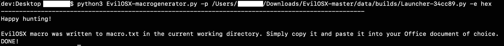

# EvilOSX_MacroGenerator
Python3 script to generate Office macros for the EvilOSX framework (https://github.com/Marten4n6/EvilOSX)

This script reads in an EvilOSX python launcher and creates a macro with either base64 encoding or hex encoding (based on the command line option specified). Therefore, you will need to pull down EvilOSX and have it drop the python launcher before running the macro generator. See steps below.

General usage:

**python3 EvilOSX-macrogenerator.py -p <path_to_EvilOSX_python_payload> -e <"hex" or "b64">**

Steps:

1. Clone the EvilOSX repo (https://github.com/Marten4n6/EvilOSX)
2. Install EvilOSX requirements (from EvilOSX root folder: $**sudo pip install -r requirements.txt**)
3. Generate an EvilOSX python launcher (from EvilOSX root folder: $**python start.py --builder**)...be sure to select the python launcher
4. Note the path where the python launcher is dropped (by default at /data/builds directory within the EvilOSX root folder)
5. Start the EvilOSX listener (**python start.py --cli --port <port>** or **python start.py**)
5. Run the macro generator from this repo: **python3 EvilOSX-macrogenerator.py -p <path_to_EvilOSX_python_payload> -e ["hex" or "b64"]**. You will use the path from #4 above for the -p option here
6. The macro generator will read the EvilOSX python payload, encode it as either base64 or hex (based on what option you enter) and write the output to a file:

7. Copy the contents of macro.txt into an Office doc (Tools -> Macro -> Macros In: [select the document name] -> Enter macro name -> Click plus button -> paste macro contents -> for Word save as .doc or .docm)

